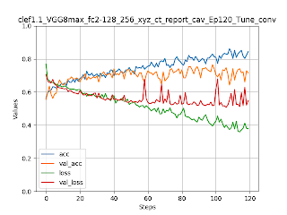
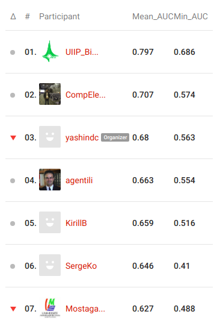
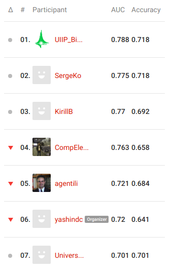

# Scripts

The scripts are not very well structured and contain some auxiliary elements used for multiple try-and-fail runs.
Running the codes requires step-by-step manual control.

The key steps are described below.

### 1. Generating CT projections

The key point of the proposed approach is converting 3D CT scans into 2D projections. 
Projections are made along each axis (X, Y, Z) and for each lung (left/right) separately. 
Subsequently, the main image classification algorithms used generated 2D projections as (part of) the input data.

The projections are generated by [go_a_gen_lung_projections.py](go_a_gen_lung_projections.py). 
The script uses original images and the corresponding lung masks. 
The results are saved to `../data/clef_projections_v1.*`. 
With this study, `clef_projections_v1.0` were generated using  lung masks provided by the organizers ([default](https://www.researchgate.net/profile/Yashin_Dicente_Cid/publication/278031286_Efficient_and_fully_automatic_segmentation_of_the_lungs_in_CT_volumes/links/557aa1ac08ae753637571d22/Efficient-and-fully-automatic-segmentation-of-the-lungs-in-CT-volumes.pdf)), 
`v1.1` were generated using the additional masks ([registration-based](https://github.com/skliff13/CT_RegSegm)), 
and `v1.2` were generated using the default masks and high intensity threshold (+1000 HU) to catch calcifications.

The examples of X, Y and Z projections for the left lung of `CTR_TRN_001` are shown below. 
In the upper lobe a large TB lesion can be clearly seen.


### 2. Training Convolutional Neural Net (CNN) for binary lung classification

Here, a CNN is trained to classify a 2D lung projection image as either healthy ("normal") or affected by TB ("abnormal"). 
The ground truth information for each lung is given in `CTR_LeftLungAffected` and `CTR_RightLungAffected` metadata values.
Splitting development data into training and validation subsets is done by [go_b_train_val_split.py](go_b_train_val_split.py).
Network training process is launched with [go_c_train_lung_binary.py](go_c_train_lung_binary.py).

The network model was trained for over 120 epochs using `v1.0` lung projections.
Accuracy and Loss plots are shown below. "Normal"/"abnormal" prediction on the validation subset resulted in 0.865 AUC value. 


### 3. Training CNNs for detection of Caverns and LungCapacityDecrease

All other labels (`LungCapacityDecrease`, `Calcification`, `Pleurisy` and `Caverns`) are specified at CT-level, without  information about the specific lung (left/right/both) having each abnormality type. 
CNNs were used to detect `LungCapacityDecrease` and `Caverns`.
In this case, the input for the CNN is composed of projections of two lungs (network input size was `256x512`), `v1.1` projections were used at this stage. 

Weights of the convolutional layers were initialized with the corresponding weights of the CNN previously trained for "normal"/"abnormal" classification.
Training process is launched with [go_d_train_ct_report_binary.py](go_d_train_ct_report_binary.py) script.
Network for `LungCapacityDecrease` was trained for 50 epochs (validation AUC = 0.832), network for `Caverns` was trained for 120 epochs (validation AUC = 0.809).




The [go_d_train_ct_report.py](go_d_train_ct_report.py) script is not used in the final run.

### 4. Assessing scores for Calcification and Pleurisy

`Calcification` and `Pleurisy` were detected using pretty simple ways. 

Scores for prediction of `Calcification` were calculated as mean intensity value of `v1.2` projections which reflects the number of voxels exceeding 1000 HU threshold (see [aux_explore_calcifications.py](aux_explore_calcifications.py)).
Evaluation on the training subset resulted in 0.719 AUC value. 

Scores for detection of `Pleurisy` were calculated as difference between the volumes of lungs segmented via two different approaches: default and registration-based (see [aux_test_pleurisy.py](aux_test_pleurisy.py)). 
Evaluation on the development (train + val) dataset resulted in 0.776 AUC.

### 5. Predicting the Test dataset (CTR subtask)

For evaluation of all the algorithms on the test CT cases, `CtPredictor3` class was used (see [ct_predictor_3.py](ct_predictor_3.py)). 
`CtPredictor3` inherits `CtPredictor2` and `CtPredictor` classes which were used for non-final CTR subtask submissions.
Evaluation on the validation and test datasets is done with [go_e_predict_validation_set.py](go_e_predict_validation_set.py) and [go_f_predict_test_set.py](go_f_predict_test_set.py).

The final evaluation on the validation subset gave the following AUC values:

```CTR_LeftLungAffected: 0.906173
CTR_RightLungAffected: 0.956522
CTR_Calcification: 0.765306
CTR_Caverns: 0.879167
CTR_Pleurisy: 0.823529
CTR_LungCapacityDecrease: 0.855882
Mean AUC: 0.864430 
```

### 6. Training CNN for TB Severity scoring (SVR subtask)

The CNN for SVR subtask was trained in a way similar to the cases with `LungCapacityDecrease` and `Caverns` (see [go_d_train_svr.py](go_d_train_svr.py)).
In this case, transfer learning considered transferring weights for all layers, not only convolutional.
Training for "HIGH"/"LOW" severity classification based solely on CT image projections took 60 epochs.
The corresponding plots are shown below.
Evaluation on the validation subset resulted in 0.768 AUC value.


### 7. TB Severity classification

The final prediction of "HIGH"/"LOW" TB severity was performed using a conventional classifier (Linear Model) trained on the CNN outputs  along with the available metadata. 
Two runs were submitted for the SVR subtask. 
The first run used all the available metadata (`md_*` data fields), the second run used only `md_DrugResistance`, `md_HigherEducation`, `md_ExPrisoner` and `md_Alcoholic`.
See [go_h_train_svr_prediction.py](go_h_train_svr_prediction.py) for details.

Evaluation on the validation subset demonstrated slightly better results for the second approach than for the first one (0.876 vs 0.844 AUC).

### Results

The proposed approaches allowed achieving good results in both 
[CTR](https://www.crowdai.org/challenges/imageclef-2019-tuberculosis-ct-report/leaderboards) and 
[SVR](https://www.crowdai.org/challenges/imageclef-2019-tuberculosis-severity-scoring/leaderboards) 
subtasks of ImageCLEF Tuberculosis 2019 task (see [UIIP_BioMed](https://www.crowdai.org/participants/uiip_biomed)).

_________

